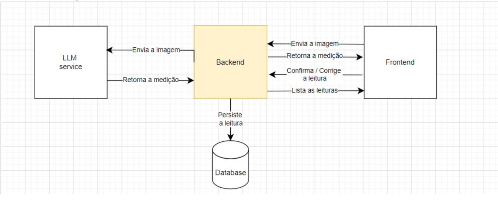

<div align="center">
    
  <h1 align="center">Micro Serviço de Leitura de Imagens</h1>

  <p align="center">   
       
    
    
    
  </p>

  <p align="center">Modelo de uso do projeto</p>
  

</div>

## 🔥 Features

- [x] Integração com o Google Gemini 🔥
- [x] Ler uma imagem e buscar os dados para salvar no banco
- [x] Listar todas as leituras por tipo e código do cliente
- [x] Confirmar a leitura com validações referentes ao mês

## 🛠️ Tecnologias

Este projeto foi desenvolvido com as seguintes tecnologias:

- `typescript`: [TypeScript on GitHub](https://github.com/microsoft/TypeScript)
- `cors`: [npm cors](https://www.npmjs.com/package/cors)
- `dotenv`: [dotenv on GitHub](https://github.com/motdotla/dotenv)
- `express`: [Express.js on GitHub](https://github.com/expressjs/express)
- `mongoose`: [Mongoose on GitHub](https://github.com/Automattic/mongoose)
- `mongoose-paginate-v2`: [npm mongoose-paginate-v2](https://www.npmjs.com/package/mongoose-paginate-v2)
- `tsup`: [tsup on NPM](https://www.npmjs.com/package/tsup)
- `Swagger`: [swagger-UI on GitHub](https://github.com/swagger-api/swagger-ui)
- `Mongo DB`: [MongoDB](https://www.mongodb.com/pt-br)
- `Multer`: [Express.Js - multer](https://github.com/expressjs/multer)
- `GeminiAI`: [Gemini-AI on docs](https://ai.google.dev/gemini-api/docs)

## 🚀 Como Rodar o Projeto

Você precisará do [Node.js](https://nodejs.org) instalado em seu computador para rodar este projeto.

```bash
git clone https://github.com/Alxdelira/service-shopper-images
cd nome-da-pasta
npm install
npm run dist


#para Rodar Localmente use 
 npm run watch
```

## Siga o modelo do env.example use sua chave da API do GEMINI AI 👌

```bash
PORT= "use a porta que desejar"

# URL do banco de dados MongoDB
DB_SHOPPER_URL=" Url do Banco de sua escolha ( usei MongoDB )"

# Variáveis de configuração do MongoDB para o container Docker
DB_SHOPPER_EXPOSE_PORT=" Aqui escolhi a porta padrão do Mongo"
DB_SHOPPER_USERNAME="USER"
DB_SHOPPER_PASSWORD="PASSWORD"
DB_SHOPPER_DATABASE=" Nome do Database" 

# Configuração de idioma e fuso horário
LANG=en_US.UTF-8
TZ=America/Porto_Velho  #Usando o horario da minha região

GEMINI_API_KEY="API_KEY"
````

## Usage

🔧 Run the script

```bash
$ npm run dev
```


Runs the app in the development mode.<br/>

## Autor

| [<br><sub>Alexandre Nogueira</sub>](https://github.com/Alxdelira) |
| :-----------------------------------------------------------------------------------------------------------------------------------------------: |
<a target="_blank" href="https://www.linkedin.com/in/alxdelira/"></a>

<br />
<br />
<br />
<br />
<br />
<br />
<p align="center">
  <a href="https://portfolioalxdelira.vercel.app/" target="_blank">
    
  </a>
</p>
